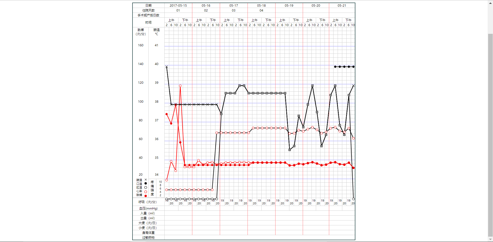

###### 1. 数据格式
                var dataset = [         //腋下温度【叉号】
                    {x: 0, y: 40}, {x: 1, y: 38},{x: 2, y: 38}, {x: 3, y: 38},
                    {x: 4, y: 38}, {x: 5, y: 38},{x: 6, y: 38}, {x: 7, y: 38},
                    {x: 8, y: 38}, {x: 9, y: 38},{x: 10, y:38}, {x: 11, y: 38},
					{x: 12, y: 37.5}, {x: 13, y: 38.6},{x: 14, y: 38.6},{x: 15, y: 38.6},
                    {x: 16, y: 39},{x: 17, y: 39},{x: 18, y: 38.6},{x: 19, y: 38.6},
                    {x: 20, y: 38.6},{x: 21, y: 38.6},{x: 22, y: 38.6},{x: 23, y: 38.6},
                    {x: 24, y: 38.6},{x: 25, y: 38.6},{x: 26, y: 38.6},{x: 27, y: 35.6},
                    {x: 28, y: 35.8},{x: 29, y: 37.4}, {x: 30, y: 36.8},{x: 31, y: 38},
                    {x: 32, y: 39},{x: 33, y: 37.6}, {x: 34, y: 35.8},{x: 35, y: 36.4},
                    {x: 36, y: 38.5},{x: 37, y:39}, {x: 38, y: 36.9},{x: 39, y: 36.4},
                    {x: 40, y: 38.5},{x: 41, y:39}
                ];
###### 2. 数据传入接口 chartLine(obj)
    obj.dataset_mouth       //口温【黑实圆】
    obj.dataset_anus        //肛温【黑空圆】
    obj.dataset_heartrate   //心率【红空圆】
    obj.dataset_pulse       //脉搏【红实圆】
    obj.dataset_pain        //脉搏【红实圆】
###### 3. 三测单截图
